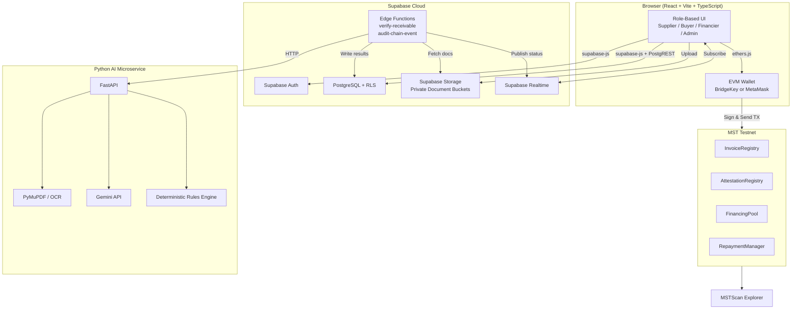
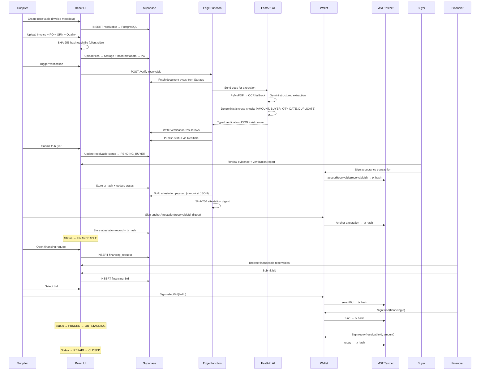
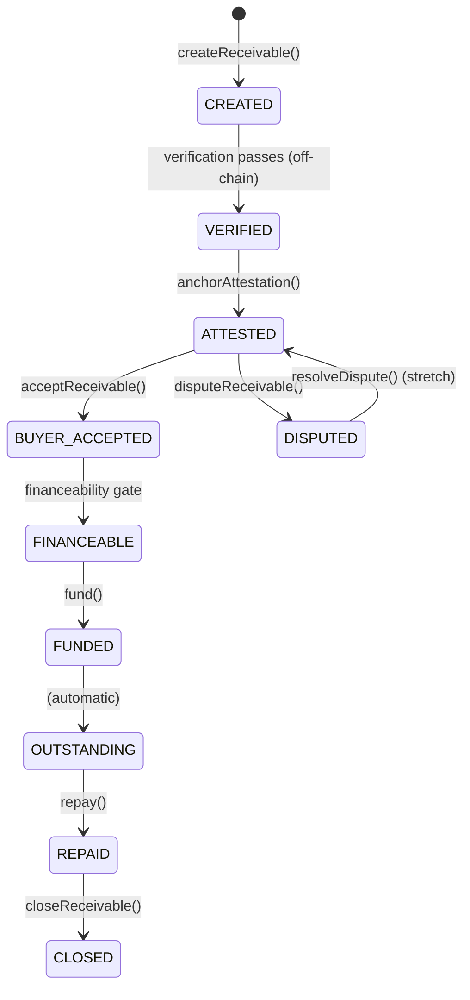

# AgriCredX — Master Execution Plan

**Team InnoVision | MST Buildathon 2026 | BMS College of Engineering**
**Source of Truth:** AgriCredX PRD + SRS v1.1 — Supabase-First Final Buildathon Specification

---

## Section A — Confirmed Understanding

### What AgriCredX Is
AgriCredX is a **blockchain-backed attested receivables financing platform** for agricultural supply chains. It is NOT "invoices on blockchain." The core idea: put **shared proof and financial lifecycle state** on the MST blockchain while keeping sensitive business documents **off-chain** in Supabase Storage.

### Exact Problem It Solves
Agricultural suppliers/exporters hold valid unpaid invoices (30–90 day payment terms) but cannot easily convert them to working capital because:
- Evidence is fragmented across PDFs, ERPs, emails, logistics systems
- Financiers cannot independently verify whether an invoice is genuine
- Documents can be altered after issuance (same filename, different content)
- A receivable could be presented to multiple financiers simultaneously (double-financing risk)
- No shared state layer exists across supplier, buyer, and financier

### The Actors
| Actor | Role |
|-------|------|
| **Supplier/Exporter** | Creates receivable, uploads evidence, requests financing, selects bid, tracks repayment |
| **Buyer** | Reviews trade evidence, accepts or disputes, signs acceptance via wallet, later repays |
| **Financier** | Browses financeable receivables, submits offers, funds selected receivable, tracks repayment |
| **Admin** | System operations, audit review, dispute visibility. Never mutates chain state silently |
| **AI Engine** | Extracts and compares data, produces risk signals. **Never** attests, approves, or releases funds |

### The Canonical Basmati Rice Scenario
| Field | Value |
|-------|-------|
| Invoice ID | INV-2026-09124 |
| Commodity | Basmati Rice |
| Invoice Amount | INR 8,50,000 |
| Payment Term | 60 days |
| Requested Financing | INR 8,20,000 |
| Buyer | ABC Foods (demo entity) |
| Supplier | Demo Basmati Exporter |
| Financiers | Financier A, Financier B, Financier C |
| Initial AI Risk | 18/100 — LOW |

### Core Innovation
Transform fragmented agricultural trade evidence into a **machine-verifiable, buyer-attested, on-chain financeable receivable** — with cryptographic tamper detection and anti-double-financing protection at the protocol level.

### Why AI
AI is an **analysis assistant**: it extracts fields from PDFs, cross-compares them deterministically, detects duplicates/tampering, and produces an explainable verification report. It is **advisory only** — the binding acceptance comes from a human business participant's wallet signature.

### Why Supabase
Supabase consolidates Auth, PostgreSQL, Storage, Realtime, and Edge Functions into a single low-friction backend. This gives the team speed during the 24-hour build without sacrificing architecture. It stores all private business data, documents, verification results, and application state.

### Why MST Blockchain
MST is the **shared trust and lifecycle state layer**. Supplier, buyer, financier, and platform each have different incentives. The blockchain holds only what multiple parties need to independently verify: document digests, wallet identities, attestation status, financing status, assignment, repayment, and lifecycle timestamps.

### Why a Wallet
The wallet provides **blockchain identity** and **transaction signing**. Every on-chain action (acceptance, attestation, funding, repayment) requires explicit user authorization through their wallet — no server can forge this.

### Off-Chain (Supabase)
- Invoice PDFs, POs, GRNs, certificates, lab reports, images
- User profiles, organization data, private addresses
- AI extraction raw text and detailed reasoning
- Risk report details
- Private financing terms
- Audit log details and application telemetry

### On-Chain (MST)
- Invoice ID
- Supplier wallet / Buyer wallet / Financier wallet
- Document hashes / attestation digest
- Lifecycle state
- Financing status / selected financier / funded amount
- State-change events / timestamps / tx hashes

### Lifecycle States
```
CREATED → VERIFIED → ATTESTED → BUYER_ACCEPTED → FINANCEABLE → FUNDED → OUTSTANDING → REPAID → CLOSED
```
Reject/Dispute paths block financeability until resolved.

### What the Demo Must Prove
1. One complete happy path: upload → verify → attest → accept → finance → repay → close
2. At least one live MST Testnet contract deployment and multiple state-changing transactions on MSTScan
3. AI extracts fields and produces PASS/WARN/FAIL verification checks
4. Changing INR 8,50,000 → INR 9,50,000 produces a different hash and blocks financeability
5. Anti-double-financing: once funded, a second financier cannot fund the same receivable
6. No private keys in source code, no fabricated blockchain data

---

## Section B — Architecture

### End-to-End Architecture Diagram



### Key Architectural Rules
1. **React ↔ Supabase**: supabase-js for Auth, PostgREST for CRUD under RLS, Storage for uploads
2. **Edge Functions**: Privileged server-side coordination (AI invocation, audit writes, controlled operations)
3. **Python FastAPI**: AI-ONLY. Not a second CRUD backend
4. **Wallet ↔ MST**: Client-side signing via ethers.js. No server holds user private keys
5. **MSTC**: Native testnet gas asset. NOT represented as INR. No conversion invented
6. **No Neo4j**: Traceability graph is a React visualization over PostgreSQL relationships

---

## Section C — Data Flow

### Happy Path Flow



### Tamper Path Flow
```
Original Invoice (INR 8,50,000) → SHA-256 → Hash_1 → Attested on MST
                                                    ↓
Modified Invoice (INR 9,50,000) → SHA-256 → Hash_2 ≠ Hash_1
                                                    ↓
                                    INTEGRITY MISMATCH → FINANCEABILITY BLOCKED
```

---

## Section D — Module Breakdown

### 1. `apps/web/` — React + Vite Frontend
| Responsibility | Dependencies |
|---|---|
| Role-based dashboards (Supplier, Buyer, Financier, Admin) | React 18, Vite, TypeScript |
| Supabase Auth integration | supabase-js |
| Data queries with caching | TanStack Query |
| Document upload with client-side hashing | SubtleCrypto (Web API) |
| Wallet connection + TX signing | ethers.js v6 |
| Verification report display | — |
| Financing marketplace | — |
| Receivable timeline/lifecycle rail | — |
| Traceability graph visualization | React-based graph library (e.g., React Flow, D3) |
| MSTScan links for every on-chain TX | — |
| Tamper detection UI | — |
| Tailwind CSS + shadcn/ui for styling | — |

### 2. `supabase/` — Backend
| Component | Responsibility |
|---|---|
| `migrations/` | PostgreSQL schema, indexes, RLS policies |
| `seed.sql` | Canonical demo dataset (INV-2026-09124) |
| `functions/verify-receivable/` | Edge Function: fetches docs from Storage, calls AI, writes results, publishes Realtime |
| `functions/audit-chain-event/` | Edge Function: records on-chain events in audit log |
| `config.toml` | Supabase project configuration |
| Storage buckets | `documents` (private), `evidence` (private) |

### 3. `services/ai/` — Python FastAPI AI Microservice
| Component | Responsibility |
|---|---|
| `app/main.py` | FastAPI app with `/extract` and `/verify` endpoints |
| `app/extractors/` | PyMuPDF text extraction, OCR fallback (Tesseract) |
| `app/llm/` | Gemini API for structured field extraction |
| `app/rules/` | Deterministic cross-check engine (AMOUNT_MATCH, BUYER_MATCH, QTY_MATCH, DATE_CONSISTENCY, DUPLICATE_ID, DOCUMENT_HASH) |
| `app/models/` | Typed input/output schemas |
| `app/hashing.py` | SHA-256 hashing utilities |
| `tests/` | Unit tests for extraction, rules, hashing |

### 4. `contracts/` — Solidity Smart Contracts
| Contract | Responsibility |
|---|---|
| `InvoiceRegistry.sol` | Create receivable, store identifiers/amounts/addresses/state, emit lifecycle events |
| `AttestationRegistry.sol` | Store attestation digest, bind to receivable ID, verification status |
| `FinancingPool.sol` | Open financing, receive selected fund, block duplicate funding |
| `RepaymentManager.sol` | Record repayment, transition REPAID → CLOSED |
| `test/` | Hardhat tests for all state transitions and invariants |
| `scripts/deploy.js` | Deterministic deployment script |

### 5. `packages/` — Shared Code
| Package | Responsibility |
|---|---|
| `shared-types/` | TypeScript interfaces shared between frontend and services |
| `chain-client/` | ethers.js contract wrappers for frontend use |
| `hashing/` | Canonical serialization and SHA-256 digest logic (must produce identical output in JS and Python) |

### 6. `data/demo/` — Demo Documents
| File | Purpose |
|---|---|
| `invoice.pdf` | Canonical invoice for INV-2026-09124, INR 8,50,000 |
| `po.pdf` | Matching purchase order |
| `grn.pdf` | Matching goods receipt note |
| `quality.pdf` | Quality certificate |
| `invoice_tampered.pdf` | Invoice with INR 9,50,000 (for tamper demo) |

---

## Section E — Smart Contract Plan

### State Machine



### Contract Interface Summary

#### InvoiceRegistry
```solidity
function createReceivable(bytes32 invoiceId, address buyer, uint256 amount, uint64 dueDate) external returns (uint256 receivableId);
function getReceivable(uint256 receivableId) external view returns (Receivable memory);
function getLifecycleState(uint256 receivableId) external view returns (State);
// Events: ReceivableCreated, StateChanged
```

**Invariants:**
- Receivable ID is unique
- Only supplier or authorized relayer can create
- State transitions are monotonic (no backward movement except explicit dispute/resolve)

#### AttestationRegistry
```solidity
function anchorAttestation(uint256 receivableId, bytes32 attestationDigest) external;
function acceptReceivable(uint256 receivableId) external;
function disputeReceivable(uint256 receivableId, bytes32 reasonHash) external;
function getAttestation(uint256 receivableId) external view returns (Attestation memory);
// Events: AttestationAnchored, ReceivableAccepted, ReceivableDisputed
```

**Invariants:**
- No acceptance based on LLM text — signer role verified
- Only configured buyer wallet can accept
- Disputed state blocks financeability

#### FinancingPool
```solidity
function openFinancing(uint256 receivableId, uint256 requestedAmount) external;
function submitBid(uint256 financingRequestId, uint256 amount, uint256 termsHash) external;
function selectBid(uint256 bidId) external;
function fund(uint256 financingId) external;
// Events: FinancingOpened, BidSubmitted, BidSelected, Funded
```

**Invariants:**
- Only FINANCEABLE receivables can have financing opened
- A receivable MUST NOT be funded twice (single-assignment invariant)
- Only selected financier can call fund()

#### RepaymentManager
```solidity
function repay(uint256 receivableId, uint256 amount) external;
function closeReceivable(uint256 receivableId) external;
// Events: Repaid, Closed
```

**Invariants:**
- Repayment only applies to FUNDED/OUTSTANDING receivables
- Repayment MUST NOT exceed recorded outstanding obligation

### Deployment Sequence
1. Deploy InvoiceRegistry
2. Deploy AttestationRegistry (references InvoiceRegistry)
3. Deploy FinancingPool (references InvoiceRegistry + AttestationRegistry)
4. Deploy RepaymentManager (references InvoiceRegistry + FinancingPool)
5. Configure cross-contract references
6. Save all addresses to `.env` and deployment manifest

> **MVP Consolidation Option:** These four logical contracts MAY be merged into 1–2 physical contracts to reduce deployment complexity, provided all logical invariants are preserved.

---

## Section F — Supabase Plan

### Tables

#### `organizations`
```sql
id UUID PRIMARY KEY DEFAULT gen_random_uuid(),
name TEXT NOT NULL,
type TEXT NOT NULL CHECK (type IN ('supplier', 'buyer', 'financier')),
contact_metadata JSONB,
created_at TIMESTAMPTZ DEFAULT now()
```

#### `profiles` (extends Supabase Auth users)
```sql
id UUID PRIMARY KEY REFERENCES auth.users(id),
role TEXT NOT NULL CHECK (role IN ('supplier', 'buyer', 'financier', 'admin')),
email TEXT NOT NULL,
organization_id UUID REFERENCES organizations(id),
wallet_address TEXT,
created_at TIMESTAMPTZ DEFAULT now()
```

#### `receivables`
```sql
id UUID PRIMARY KEY DEFAULT gen_random_uuid(),
invoice_id TEXT NOT NULL UNIQUE,
supplier_id UUID NOT NULL REFERENCES profiles(id),
buyer_id UUID NOT NULL REFERENCES profiles(id),
amount NUMERIC(15,2) NOT NULL,
currency TEXT NOT NULL DEFAULT 'INR',
due_date DATE NOT NULL,
commodity TEXT NOT NULL,
status TEXT NOT NULL DEFAULT 'CREATED' CHECK (status IN ('CREATED','VERIFIED','ATTESTED','BUYER_ACCEPTED','FINANCEABLE','FUNDED','OUTSTANDING','REPAID','CLOSED','DISPUTED')),
attestation_digest TEXT,
on_chain_id INTEGER,
created_at TIMESTAMPTZ DEFAULT now(),
updated_at TIMESTAMPTZ DEFAULT now()
```

#### `documents`
```sql
id UUID PRIMARY KEY DEFAULT gen_random_uuid(),
receivable_id UUID NOT NULL REFERENCES receivables(id),
type TEXT NOT NULL CHECK (type IN ('invoice', 'purchase_order', 'grn', 'quality_certificate')),
filename TEXT NOT NULL,
mime_type TEXT NOT NULL,
sha256 TEXT NOT NULL,
object_key TEXT NOT NULL,
version INTEGER NOT NULL DEFAULT 1,
is_active BOOLEAN DEFAULT true,
uploaded_by UUID NOT NULL REFERENCES profiles(id),
uploaded_at TIMESTAMPTZ DEFAULT now()
```

#### `verification_results`
```sql
id UUID PRIMARY KEY DEFAULT gen_random_uuid(),
receivable_id UUID NOT NULL REFERENCES receivables(id),
check_code TEXT NOT NULL,
status TEXT NOT NULL CHECK (status IN ('PASS', 'WARN', 'FAIL')),
extracted_value TEXT,
expected_value TEXT,
explanation TEXT NOT NULL,
engine_version TEXT NOT NULL DEFAULT 'v1',
created_at TIMESTAMPTZ DEFAULT now()
```

#### `attestations`
```sql
id UUID PRIMARY KEY DEFAULT gen_random_uuid(),
receivable_id UUID NOT NULL REFERENCES receivables(id),
digest TEXT NOT NULL,
signer_wallet TEXT NOT NULL,
tx_hash TEXT,
block_reference TEXT,
timestamp TIMESTAMPTZ DEFAULT now(),
schema_version TEXT NOT NULL DEFAULT '1.0'
```

#### `financing_requests`
```sql
id UUID PRIMARY KEY DEFAULT gen_random_uuid(),
receivable_id UUID NOT NULL REFERENCES receivables(id),
requested_amount NUMERIC(15,2) NOT NULL,
desired_term INTEGER,
status TEXT NOT NULL DEFAULT 'OPEN' CHECK (status IN ('OPEN', 'SELECTED', 'FUNDED', 'CLOSED')),
created_at TIMESTAMPTZ DEFAULT now()
```

#### `financing_bids`
```sql
id UUID PRIMARY KEY DEFAULT gen_random_uuid(),
request_id UUID NOT NULL REFERENCES financing_requests(id),
financier_id UUID NOT NULL REFERENCES profiles(id),
amount NUMERIC(15,2) NOT NULL,
fee_or_discount NUMERIC(5,2),
maturity DATE,
status TEXT NOT NULL DEFAULT 'OPEN' CHECK (status IN ('OPEN', 'SELECTED', 'REJECTED')),
tx_hash TEXT,
created_at TIMESTAMPTZ DEFAULT now()
```

#### `financings`
```sql
id UUID PRIMARY KEY DEFAULT gen_random_uuid(),
receivable_id UUID NOT NULL REFERENCES receivables(id),
financier_id UUID NOT NULL REFERENCES profiles(id),
funded_amount NUMERIC(15,2) NOT NULL,
funded_at TIMESTAMPTZ,
status TEXT NOT NULL DEFAULT 'ACTIVE',
tx_hash TEXT
```

#### `repayments`
```sql
id UUID PRIMARY KEY DEFAULT gen_random_uuid(),
receivable_id UUID NOT NULL REFERENCES receivables(id),
amount NUMERIC(15,2) NOT NULL,
paid_at TIMESTAMPTZ DEFAULT now(),
tx_hash TEXT,
status TEXT NOT NULL DEFAULT 'CONFIRMED'
```

#### `audit_logs`
```sql
id UUID PRIMARY KEY DEFAULT gen_random_uuid(),
actor_id UUID REFERENCES profiles(id),
action TEXT NOT NULL,
entity_type TEXT NOT NULL,
entity_id UUID,
metadata_json JSONB,
created_at TIMESTAMPTZ DEFAULT now()
```

### Storage Buckets
- **`documents`** — Private bucket for Invoice/PO/GRN/Quality PDFs. Access controlled via RLS-backed signed URLs.

### Auth
- Supabase Auth with email/password for demo users
- Roles stored in `profiles.role`
- Demo accounts seeded: 1 Supplier, 1 Buyer, 3 Financiers, 1 Admin

### RLS Policies (Critical)
- **receivables**: Supplier sees own; Buyer sees where they are the buyer; Financier sees FINANCEABLE+
- **documents**: Only supplier (owner) and buyer (of that receivable) can read
- **verification_results**: Readable by supplier, buyer, and financier (for financeable receivables)
- **financing_bids**: Financier sees own; Supplier sees bids on own receivables
- **audit_logs**: Admin only
- **Service-role key**: NEVER in browser code. Edge Functions only.

### Realtime
- Subscribe to `receivables` status changes for live dashboard updates
- Subscribe to `verification_results` for AI processing completion notifications

### Migrations
- Single initial migration with all tables
- `seed.sql` for canonical demo data with demo organizations, users, and the INV-2026-09124 receivable

---

## Section G — AI Plan

### Pipeline Architecture
```
Document bytes (from Supabase Storage)
    ↓
PyMuPDF text extraction (PREFERRED)
    ↓
OCR fallback (Tesseract) — only when PyMuPDF returns insufficient text
    ↓
Gemini API — structured field extraction into typed JSON
    ↓
Normalization (amounts, dates, entity names)
    ↓
Deterministic cross-document checks
    ↓
Duplicate detection (invoice ID + document hash)
    ↓
Explainable verification report (PASS/WARN/FAIL per check)
    ↓
Risk score computation
    ↓
Persist results via Edge Function → Supabase
```

### Extraction Schema (AI Output)
```json
{
  "invoiceNumber": "INV-2026-09124",
  "supplierName": "Demo Basmati Exporter",
  "buyerName": "ABC Foods",
  "invoiceAmount": 850000,
  "currency": "INR",
  "invoiceDate": "2026-09-20",
  "quantity": 5000,
  "unit": "kg",
  "commodity": "Basmati Rice",
  "poNumber": "PO-2026-4501",
  "poAmount": 850000,
  "poBuyer": "ABC Foods",
  "grnQuantity": 5000,
  "grnDate": "2026-09-22",
  "confidence": 0.95
}
```

### Minimum Deterministic Checks
| Code | Inputs | PASS Condition |
|------|--------|----------------|
| `AMOUNT_MATCH` | Invoice amount, PO amount | Equal after normalization |
| `BUYER_MATCH` | Invoice buyer, PO buyer | Normalized names match |
| `QTY_MATCH` | Invoice quantity, GRN quantity | Exact match (MVP) |
| `DATE_CONSISTENCY` | Invoice date, PO date, GRN date | PO ≤ Invoice ≤ GRN sequence |
| `DUPLICATE_ID` | Invoice ID vs existing receivables | No active duplicate |
| `DOCUMENT_HASH` | Current hash vs attested hash | Equal for unchanged docs |

### Risk Output Schema
```json
{
  "riskScore": 18,
  "riskBand": "LOW",
  "checks": [
    {"code": "AMOUNT_MATCH", "status": "PASS", "explanation": "Invoice and PO amount match at INR 8,50,000."},
    {"code": "BUYER_MATCH", "status": "PASS", "explanation": "Invoice buyer 'ABC Foods' matches PO buyer."},
    {"code": "QTY_MATCH", "status": "PASS", "explanation": "Invoice quantity 5000 kg matches GRN quantity."},
    {"code": "DATE_CONSISTENCY", "status": "PASS", "explanation": "PO date precedes invoice date which precedes GRN date."},
    {"code": "DUPLICATE_ID", "status": "PASS", "explanation": "Invoice ID INV-2026-09124 is not already financed."},
    {"code": "DOCUMENT_HASH", "status": "PASS", "explanation": "All document hashes are consistent."}
  ],
  "engineVersion": "v1"
}
```

### Anti-Hallucination AI Rules
1. LLM output is **untrusted text** until converted into typed fields
2. All typed fields are validated against deterministic rules
3. AI NEVER directly moves a receivable to buyer-accepted or funded
4. Document text is treated as DATA — never execute embedded instructions (prompt injection defense)
5. Every check gets an explanation, not just a score

---

## Section H — Frontend Plan

### Routes & Screens

| Route | Screen | Role | Key Content |
|-------|--------|------|-------------|
| `/` | Landing | Public | Problem statement, value proposition, role entry, demo CTA |
| `/login` | Auth | Public | Supabase Auth login with role selection |
| `/supplier` | Supplier Dashboard | Supplier | Receivable list, status badges, financing state |
| `/supplier/receivables/new` | Create Receivable | Supplier | Invoice metadata form (ID, amount, due date, currency, buyer, commodity) |
| `/supplier/receivables/:id` | **Receivable Command Center** (HERO) | Supplier | Full lifecycle view — see below |
| `/supplier/receivables/:id/upload` | Document Upload | Supplier | Multi-doc upload with hash status, type selector |
| `/buyer` | Buyer Dashboard | Buyer | Pending reviews, accepted, repayment due |
| `/buyer/receivables/:id` | Buyer Review | Buyer | Evidence summary, verification checks, Accept/Dispute, wallet signing |
| `/marketplace` | Financing Marketplace | Financier | Financeable receivables, attestation status, risk overview |
| `/marketplace/:id` | Financier Detail | Financier | Attestation, buyer acceptance, evidence summary, risk flags, bid form, fund action |
| `/admin` | Admin Dashboard | Admin | Audit log, system status, dispute visibility |
| `/tamper-test` | Tamper Demo | All | Side-by-side original vs modified, hash comparison, blocked state |

### The Hero Screen: Receivable Command Center
This is the single most important page. It tells the complete story:

```
┌─────────────────────────────────────────────────────────────────┐
│  RECEIVABLE COMMAND CENTER — INV-2026-09124                     │
├──────────────┬──────────────────────────────────────────────────┤
│              │                                                  │
│  LIFECYCLE   │  ● CREATED → ✓ VERIFIED → ✓ ATTESTED →         │
│  RAIL        │    ✓ BUYER_ACCEPTED → ● FINANCEABLE              │
│              │                                                  │
├──────────────┼──────────────────────────────────────────────────┤
│              │                                                  │
│  EVIDENCE    │  Invoice ✓ (sha256: a1b2...)                    │
│  PANEL       │  PO ✓ (sha256: c3d4...)                         │
│              │  GRN ✓ (sha256: e5f6...)                        │
│              │  Quality Cert ✓ (sha256: 7890...)               │
│              │                                                  │
├──────────────┼──────────────────────────────────────────────────┤
│              │                                                  │
│  VERIFICATION│  AMOUNT_MATCH: ✓ PASS                            │
│  MATRIX      │  BUYER_MATCH: ✓ PASS                             │
│              │  QTY_MATCH: ✓ PASS                               │
│              │  DATE_CONSISTENCY: ✓ PASS                        │
│              │  DUPLICATE_ID: ✓ PASS                            │
│              │  Risk: 18/100 LOW                                 │
│              │                                                  │
├──────────────┼──────────────────────────────────────────────────┤
│              │                                                  │
│  ATTESTATION │  Digest: 0xabc123...                             │
│  & CHAIN     │  Buyer Wallet: 0xdef456...                      │
│              │  TX: 0x789... → [View on MSTScan]               │
│              │                                                  │
├──────────────┼──────────────────────────────────────────────────┤
│              │                                                  │
│  FINANCING   │  Requested: INR 8,20,000                        │
│  STATE       │  Bids: 3 offers                                 │
│              │  Selected: Financier A — INR 8,00,000            │
│              │  Status: FUNDED → [TX on MSTScan]               │
│              │                                                  │
├──────────────┼──────────────────────────────────────────────────┤
│              │                                                  │
│  TIMELINE    │  09:00 — Created by Demo Basmati Exporter        │
│              │  09:05 — Documents uploaded (4 files)            │
│              │  09:07 — Verification complete — LOW risk         │
│              │  09:12 — Buyer accepted (TX: 0x...)              │
│              │  09:15 — Attestation anchored (TX: 0x...)        │
│              │  09:20 — Financing opened                        │
│              │  09:25 — Bid selected — Financier A              │
│              │  09:30 — Funded (TX: 0x...)                      │
│              │                                                  │
└──────────────┴──────────────────────────────────────────────────┘
```

### State Management
- **TanStack Query** for server state (Supabase data, caching, refetch)
- **Supabase Realtime** subscriptions for live status updates
- **React Context** for auth state and wallet connection
- **ethers.js** for wallet interactions (connect, sign, send TX, wait for receipt)

### Loading & Error States
- Every async action shows PENDING state (never fabricate "confirmed")
- Chain writes show wallet confirmation prompt → PENDING → CONFIRMED with TX hash
- RPC failures show actionable error with retry
- Malformed file uploads show specific error message

---

## Section I — Design System

### Visual Identity: "Institutional Trust Operating System"

This is NOT a generic SaaS dashboard. AgriCredX should feel like a **high-trust financial forensic operating system** — the kind of interface that institutional finance, audit firms, and trade verification platforms would use.

### Design Principles

1. **Evidence → Trust → Finance** — this narrative must be visible in the visual hierarchy
2. **Information density over decoration** — a judge should understand the trust state within seconds
3. **Purposeful motion only** — animations explain state changes, not decoration
4. **Distinctive but credible** — premium and institutional, not flashy startup

### Color System

| Token | Value | Usage |
|-------|-------|-------|
| `--surface-primary` | `hsl(220, 20%, 97%)` | Page background — warm neutral, not stark white |
| `--surface-elevated` | `hsl(0, 0%, 100%)` | Cards and panels |
| `--surface-dark` | `hsl(222, 47%, 11%)` | Header bar, sidebar |
| `--text-primary` | `hsl(222, 47%, 11%)` | Primary text |
| `--text-secondary` | `hsl(215, 16%, 47%)` | Secondary labels |
| `--accent-trust` | `hsl(152, 57%, 42%)` | VERIFIED, PASS, ATTESTED — trust green |
| `--accent-finance` | `hsl(217, 91%, 60%)` | FINANCEABLE, FUNDED — institutional blue |
| `--accent-warning` | `hsl(38, 92%, 50%)` | WARN, PENDING — amber |
| `--accent-danger` | `hsl(0, 84%, 60%)` | FAIL, TAMPERED, DISPUTED — alert red |
| `--accent-chain` | `hsl(270, 60%, 58%)` | MST blockchain, wallet, TX — chain purple |
| `--accent-muted` | `hsl(215, 20%, 65%)` | Inactive states, borders |

### Typography
- **Primary font**: `Inter` (Google Fonts) — professional, highly legible
- **Monospace**: `JetBrains Mono` — hashes, wallet addresses, TX hashes
- **Heading scale**: 28/24/20/16 — restrained, not oversized

### Key Visual Components

1. **Lifecycle Rail** — horizontal step indicator showing the receivable's journey from CREATED to CLOSED. Each step has an icon, label, timestamp, and tx link. Active step is highlighted with `--accent-finance`.

2. **Verification Matrix** — compact grid of check codes with PASS (green check) / WARN (amber triangle) / FAIL (red x), extracted values, and explanations. Not cards — a dense, scannable table.

3. **Evidence Panel** — document list with type icon, filename, SHA-256 (truncated, monospace), integrity status badge, and view/download actions.

4. **Blockchain Proof Strip** — dark-background strip showing: Wallet → TX Hash → Block → MSTScan Link. Monospace text, chain purple accent.

5. **Tamper Alert** — when integrity mismatch detected: full-width alert bar with original hash vs current hash in monospace side-by-side, red "INTEGRITY MISMATCH" badge, "FINANCEABILITY BLOCKED" state.

6. **Risk Indicator** — circular gauge showing 18/100 with "LOW" band. Minimal, not a flashy dashboard widget.

7. **Timeline** — vertical event log with timestamps, actor identities, actions, and linked TX hashes. Compact, not decorative.

### Animation Rules
- ✅ State transition animations (status badge morphing from PENDING → CONFIRMED)
- ✅ Verification completion (checks appearing sequentially as they pass)
- ✅ Attestation anchor (digest appearing with a "committed" confirmation pulse)
- ✅ Tamper alert entrance (hash mismatch reveal, red state transition)
- ❌ No gratuitous page transitions
- ❌ No floating particles or gradients
- ❌ No generic "futuristic" animations
- ❌ No glassmorphism

---

## Section J — GitHub Plan

### Branch Strategy

```
main (protected — merge only)
├── lead/blockchain-frontend    (Developer 1)
└── dev2/backend-ai             (Developer 2)
```

### Developer 1 — Lead (60%)
**Owns:** Architecture, MST integration, Solidity/Hardhat smart contracts, wallet integration, React/Vite frontend, UX architecture, financing marketplace UI, lifecycle UI, traceability graph, end-to-end integration, deployment, final demo

**Works in:**
- `contracts/`
- `apps/web/`
- `packages/chain-client/`
- `packages/shared-types/`
- Root config files

### Developer 2 — Backend + AI (40%)
**Owns:** Supabase (PostgreSQL, Auth, Storage, RLS, Realtime, Edge Functions), FastAPI, PyMuPDF, OCR, Gemini, deterministic verification, risk engine, document hashing, tamper detection, backend APIs

**Works in:**
- `supabase/`
- `services/ai/`
- `packages/hashing/`
- `packages/shared-types/` (shared types only)

### Interface Contracts (Define BEFORE Parallel Work)

#### Contract 1: AI Service → Edge Function
```typescript
// POST /verify
interface VerificationRequest {
  receivableId: string;
  documents: Array<{
    type: 'invoice' | 'purchase_order' | 'grn' | 'quality_certificate';
    url: string; // signed URL from Supabase Storage
    sha256: string;
  }>;
}

interface VerificationResponse {
  riskScore: number;
  riskBand: 'LOW' | 'MEDIUM' | 'HIGH';
  checks: Array<{
    code: string;
    status: 'PASS' | 'WARN' | 'FAIL';
    extractedValue?: string;
    expectedValue?: string;
    explanation: string;
  }>;
  extractedFields: Record<string, any>;
  engineVersion: string;
}
```

#### Contract 2: Frontend → Blockchain
```typescript
interface ChainClient {
  createReceivable(invoiceId: string, buyer: string, amount: bigint, dueDate: number): Promise<TransactionReceipt>;
  anchorAttestation(receivableId: number, digest: string): Promise<TransactionReceipt>;
  acceptReceivable(receivableId: number): Promise<TransactionReceipt>;
  openFinancing(receivableId: number, requestedAmount: bigint): Promise<TransactionReceipt>;
  submitBid(requestId: number, amount: bigint, termsHash: string): Promise<TransactionReceipt>;
  selectBid(bidId: number): Promise<TransactionReceipt>;
  fund(financingId: number): Promise<TransactionReceipt>;
  repay(receivableId: number, amount: bigint): Promise<TransactionReceipt>;
}
```

#### Contract 3: Supabase → Frontend
All data accessed via supabase-js with PostgREST under RLS. Shared types define the row shapes.

### Merge Strategy
- Each developer works on their branch independently
- Integration merges happen at defined milestones (hours 8, 12, 16, 20)
- Developer 1 is merge coordinator
- Conflict zones minimized by interface contracts

---

## Section K — 24-Hour Execution Schedule

### Phase 0: Repository Setup & Environment (Hour 0–1)
| Task | Owner | Deliverable |
|------|-------|-------------|
| Initialize monorepo structure per Appendix B | Dev 1 | Directory structure |
| Verify MST Testnet identity (RPC, chain ID, explorer) | Dev 1 | `.env.example` with verified values |
| Acquire test MSTC from faucet | Dev 1 | Funded deployer wallet |
| Create Supabase project | Dev 2 | Project URL + anon key |
| Set up Hardhat with MST Testnet config | Dev 1 | `hardhat.config.ts` |
| Set up React + Vite + TypeScript + Tailwind + shadcn | Dev 1 | `apps/web/` scaffold |
| Set up Python FastAPI project | Dev 2 | `services/ai/` scaffold |
| Define interface contracts (all 3) | Both | `packages/shared-types/` |

### Phase 1: Blockchain Foundation (Hours 1–4)
| Task | Owner | Deliverable |
|------|-------|-------------|
| Write InvoiceRegistry.sol | Dev 1 | Contract with createReceivable, state machine |
| Write AttestationRegistry.sol | Dev 1 | Contract with anchorAttestation, accept, dispute |
| Write FinancingPool.sol | Dev 1 | Contract with bid/select/fund, anti-double-funding |
| Write RepaymentManager.sol | Dev 1 | Contract with repay, close |
| Hardhat unit tests for all state transitions | Dev 1 | Passing test suite |
| Deploy to MST Testnet | Dev 1 | Deployed addresses, verified on MSTScan |

### Phase 2: Supabase Foundation (Hours 1–5) — Parallel with Phase 1
| Task | Owner | Deliverable |
|------|-------|-------------|
| Write initial migration (all tables) | Dev 2 | `migrations/001_initial.sql` |
| Configure RLS policies for every table | Dev 2 | Tested policies |
| Create Storage bucket `documents` (private) | Dev 2 | Bucket with access rules |
| Set up Supabase Auth with demo accounts | Dev 2 | 6 seeded users (supplier, buyer, 3 financiers, admin) |
| Write `seed.sql` for canonical demo data | Dev 2 | Seedable dataset |
| Test RLS: supplier can't see other supplier's data | Dev 2 | Passing test |

### Phase 3: AI Verification Service (Hours 4–8)
| Task | Owner | Deliverable |
|------|-------|-------------|
| Implement PyMuPDF text extraction | Dev 2 | Extracts text from demo PDFs |
| Implement OCR fallback (Tesseract) | Dev 2 | Handles scanned PDFs |
| Implement Gemini structured extraction | Dev 2 | Typed JSON output matching schema |
| Implement deterministic rule engine (6 checks) | Dev 2 | PASS/WARN/FAIL for each check |
| Implement SHA-256 document hashing | Dev 2 | Deterministic hash for identical bytes |
| Implement risk score computation | Dev 2 | 18/100 LOW for canonical scenario |
| Write `verify-receivable` Edge Function | Dev 2 | Fetches docs, calls AI, writes results |
| Unit tests for extraction + rules | Dev 2 | Passing tests |

### Phase 4: Frontend Core (Hours 5–10) — Parallel with Phase 3
| Task | Owner | Deliverable |
|------|-------|-------------|
| Supabase Auth integration (login, role routing) | Dev 1 | Working login for all roles |
| Supplier Dashboard (receivable list, status) | Dev 1 | Dashboard with real Supabase data |
| Create Receivable form | Dev 1 | Form → Supabase insert |
| Document Upload with client-side SHA-256 | Dev 1 | Upload → Storage + hash → PG |
| Wallet connection (ethers.js) | Dev 1 | MetaMask/BridgeKey connected |
| Verification Report display | Dev 1 | PASS/WARN/FAIL matrix |
| Buyer Review screen with Accept/Dispute | Dev 1 | Buyer can view and interact |
| Blockchain Proof Strip component | Dev 1 | TX hash + MSTScan link |

### Phase 5: End-to-End Integration (Hours 8–12)
| Task | Owner | Deliverable |
|------|-------|-------------|
| Connect React → Supabase → AI verification flow | Both | Upload triggers AI, results appear in UI |
| Connect wallet → createReceivable on MST | Dev 1 | TX on MSTScan |
| Connect buyer acceptance → wallet → acceptReceivable on MST | Dev 1 | Real testnet TX |
| Attestation digest computation (canonical JSON → SHA-256) | Both | Deterministic digest |
| Connect anchorAttestation → MST | Dev 1 | Attestation on-chain |
| Financeability gate (ATTESTED + BUYER_ACCEPTED → FINANCEABLE) | Dev 1 | UI reflects state |
| Realtime subscription for status changes | Dev 1 | Live dashboard updates |
| **MILESTONE: ONE COMPLETE HAPPY PATH** | Both | ✅ Upload → Verify → Attest → Accept → FINANCEABLE |

### Phase 6: Financing + Repayment (Hours 12–14)
| Task | Owner | Deliverable |
|------|-------|-------------|
| Financing marketplace UI | Dev 1 | Financier browses financeable receivables |
| Bid submission form + Supabase storage | Dev 1 | Bid appears in marketplace |
| Bid selection + wallet → selectBid on MST | Dev 1 | TX on MSTScan |
| Fund flow + wallet → fund on MST | Dev 1 | FUNDED state on-chain |
| Repayment UI + wallet → repay on MST | Dev 1 | REPAID → CLOSED on-chain |
| Audit log integration | Dev 2 | Every action logged |

### Phase 7: Tamper Attack Demo (Hours 14–16)
| Task | Owner | Deliverable |
|------|-------|-------------|
| Create tampered demo document (INR 9,50,000) | Dev 2 | `invoice_tampered.pdf` |
| Tamper detection in AI service | Dev 2 | DOCUMENT_HASH check returns FAIL |
| Tamper test page in UI | Dev 1 | Side-by-side hash comparison |
| INTEGRITY MISMATCH → FINANCEABILITY BLOCKED UX | Dev 1 | Visual alert with hash evidence |
| Document version tracking | Dev 2 | Previous version preserved |

### Phase 8: UI Polish (Hours 16–18)
| Task | Owner | Deliverable |
|------|-------|-------------|
| Receivable Command Center (hero screen) polish | Dev 1 | Lifecycle rail, evidence panel, verification matrix, blockchain proof |
| Traceability graph visualization (if time) | Dev 1 | React-based graph |
| Loading states for all async operations | Dev 1 | PENDING → CONFIRMED patterns |
| Error states for RPC failures, rejected TXs | Dev 1 | Actionable error messages |
| Empty states for dashboards | Dev 1 | Meaningful empty state UX |
| Landing page | Dev 1 | Problem + value prop + CTA |

### Phase 9: Security + Testing (Hours 18–20)
| Task | Owner | Deliverable |
|------|-------|-------------|
| RLS policy tests | Dev 2 | All access rules verified |
| Smart contract prohibited transition tests | Dev 1 | Duplicate funding blocked, etc. |
| Secret scan (no keys in source) | Both | Clean repo |
| Duplicate financing attempt test | Dev 1 | Second fund() reverts |
| Demo reset/seed script | Dev 2 | Full state reset capability |
| Cross-browser wallet test | Dev 1 | Wallet connects reliably |

### Phase 10: Dress Rehearsal (Hours 20–22)
| Task | Owner | Deliverable |
|------|-------|-------------|
| Run exact 120–180 second judge script twice | Both | Smooth demo run |
| Capture backup video recording | Both | Fallback demo media |
| Capture screenshots of every key state | Both | Presentation assets |
| Test live MST transaction during rehearsal | Dev 1 | At least one live TX confirmed |
| Verify MSTScan links work | Dev 1 | All TX links resolve |

### Phase 11: Freeze (Hours 22–24)
| Task | Owner | Deliverable |
|------|-------|-------------|
| NO new features | Both | Stability |
| Final bug fixes only | Both | Only critical fixes |
| Deployment verification | Both | All services accessible |
| Pitch rehearsal | Both | 120–180 second presentation |
| README with setup instructions | Dev 1 | Reproducible from repo |

---

## Section L — Risks and Blockers

| Risk | Impact | Mitigation |
|------|--------|------------|
| **MST Testnet RPC unavailable / unverified** | CRITICAL — no blockchain integration | Verify RPC within first hour. Fallback: local Hardhat node for development, deploy to MST when available |
| **MST chain ID / explorer unknown** | HIGH — cannot verify transactions | Use environment variables, verify from official MST docs or organizers |
| **BridgeKey wallet unavailable or incompatible** | MEDIUM — wallet integration blocked | Fall back to MetaMask (MetaMask is listed as supported by MST) |
| **Supabase RLS misconfigured** | HIGH — security vulnerability or broken access | Test RLS policies immediately after creation, before building features |
| **AI extraction fails on demo PDFs** | HIGH — verification pipeline broken | Use purpose-built demo PDFs with clear text. PyMuPDF should extract cleanly. OCR is fallback |
| **OCR produces bad output** | MEDIUM — verification checks fail | Demo PDFs should be text-based (not scanned). OCR is a fallback, not primary |
| **Gemini API rate limits or unavailable** | MEDIUM — structured extraction fails | Cache extraction results. Fallback: manual structured input for demo |
| **Blockchain transaction fails during demo** | HIGH — demo breaks | Keep pre-verified testnet contract + at least one confirmed TX as backup. Run fresh TX if network is stable |
| **Demo Wi-Fi failure** | HIGH — live demo impossible | Pre-record backup video. Keep seedable local state. Have screenshots ready |
| **Gas (MSTC) runs out** | MEDIUM — can't send transactions | Get ample test MSTC from faucet upfront. Multiple faucet requests if needed |
| **Two developers — merge conflicts** | MEDIUM — integration delays | Define interface contracts upfront. Minimal shared-file overlap |
| **Time overrun on contracts** | HIGH — blocks downstream features | Prioritize MVP contract with consolidated logic over 4 separate perfect contracts |
| **Attestation digest non-determinism** | HIGH — tamper demo fails | Fix serialization order in code and test BEFORE deployment |

---

## Section M — Definition of Done

The MVP is complete when ALL of the following are demonstrably working:

### MUST WORK ✅
- [ ] MST Testnet connection verified (RPC + chain ID + explorer)
- [ ] At least one smart contract deployed and visible on MSTScan
- [ ] Supplier creates canonical receivable INV-2026-09124 (INR 8,50,000, 60-day term)
- [ ] Supplier uploads Invoice + PO + GRN with deterministic SHA-256 hashes
- [ ] AI/OCR extracts fields and produces verification report with PASS/WARN/FAIL
- [ ] Deterministic cross-checks: AMOUNT_MATCH, BUYER_MATCH, QTY_MATCH at minimum
- [ ] Buyer reviews evidence and signs acceptance via wallet → real testnet TX hash
- [ ] Attestation digest computed from canonical payload and anchored on MST
- [ ] FINANCEABLE state reached only after ATTESTED + BUYER_ACCEPTED
- [ ] At least one financing bid submitted and selected
- [ ] Funding recorded (FUNDED state) with on-chain event
- [ ] Repayment recorded (REPAID → CLOSED) with on-chain event
- [ ] Changing INR 8,50,000 to INR 9,50,000 produces different hash → INTEGRITY MISMATCH → FINANCEABILITY BLOCKED
- [ ] Every blockchain action has a clickable MSTScan link
- [ ] No private keys, seed phrases, or service-role keys in source code, frontend bundle, or Git
- [ ] Demo can be restored from a seed/reset script
- [ ] 120–180 second judge demo rehearsed at least twice
- [ ] Polished, distinctive UI that communicates Evidence → Trust → Finance

### OPTIONAL (IF TIME) 🔄
- [ ] Multiple competing financing bids from different financiers
- [ ] QR-based receivable verification page
- [ ] Full traceability graph (Farm → Batch → Quality → Exporter → Invoice → Buyer → Financier → Repayment)
- [ ] Document version history UI
- [ ] Dispute workflow with admin visibility
- [ ] Advanced analytics dashboard
- [ ] Verification report export as JSON/PDF

---

## Section N — Unknowns Requiring Verification

> [!CAUTION]
> The following values are **UNKNOWN** and MUST be verified from official MST documentation or hackathon organizers before implementation. Do NOT fabricate these.

| Unknown | Current Status | What Depends On It | Where To Verify |
|---------|---------------|-------------------|-----------------|
| `MST_RPC_URL` | Placeholder: `<OFFICIAL_MST_TESTNET_RPC>` | All blockchain transactions, contract deployment | MST official site, organizer materials |
| `MST_CHAIN_ID` | Placeholder: `<CONFIRMED_BY_MST_OR_ORGANIZERS>` | Wallet network configuration, ethers.js provider setup | MST official site, organizer materials |
| `MST_EXPLORER_URL` | Partially known: `https://testnet.mstscan.com/` (currently shows maintenance notice) | All MSTScan links in UI | Verify at build time that explorer is operational |
| MST Testnet faucet availability | Known URL: `https://faucet.mstblockchain.com/` | Getting test MSTC for deployment and demo | Test faucet at build time |
| BridgeKey wallet availability/compatibility | BridgeKey site exists at `https://bridgekey.io/` | Wallet integration choice | Test BridgeKey at build time; MetaMask as fallback |
| Contract addresses | Not yet deployed | Frontend contract interaction, environment config | Will be known after deployment |
| `DEPLOYER_PRIVATE_KEY` | Must be generated or imported at build time | Contract deployment | Generate testnet wallet, fund from faucet |
| Supabase project URL + keys | Not yet created | All backend operations | Create Supabase project at build time |
| `AI_SERVICE_URL` | Depends on deployment platform (Render/Fly.io) | Edge Function → AI communication | Determined at deployment |
| Gemini API key | Must be obtained | AI structured extraction | Google AI Studio |
| MST block time / gas limits | Unknown specific values | Transaction timeout configuration | MST documentation or empirical testing |
| MSTScan API availability | Unknown | Programmatic TX verification (optional) | Test at build time |

---

## Your Manual Responsibilities (What You Must Do Yourself)

> [!IMPORTANT]
> The following tasks **cannot be performed by me** and require your direct action.

### Before the Hackathon Starts

1. **Create a Supabase Project**
   - Go to [supabase.com](https://supabase.com), create a new project
   - Record: Project URL, Anon Key, Service Role Key (keep service role key secret)
   - Enable email/password auth

2. **Obtain MST Testnet Identity**
   - Visit [MST official site](https://newsite.mstblockchain.com/) and find: RPC URL, Chain ID
   - Visit [MST Testnet Explorer](https://testnet.mstscan.com/) — verify it's operational
   - Record these in your `.env` file

3. **Create/Import a Testnet Wallet**
   - Install BridgeKey from [bridgekey.io](https://bridgekey.io/) OR use MetaMask
   - Create a new wallet or import an existing one
   - Add MST Testnet as a custom network (RPC URL + Chain ID)
   - **SECURELY store** the private key and seed phrase — NEVER commit to Git
   - Record the deployer wallet address

4. **Fund the Wallet with Test MSTC**
   - Visit [MST Faucet](https://faucet.mstblockchain.com/)
   - Request test MSTC for your deployer wallet address
   - Request enough for multiple contract deployments + demo transactions (request multiple times if allowed)

5. **Obtain a Gemini API Key**
   - Go to [Google AI Studio](https://aistudio.google.com/)
   - Create an API key for the Gemini model
   - This will be used by the Python AI service for structured document extraction
   - Store as `GEMINI_API_KEY` in your server-side environment only

6. **Prepare Demo PDF Documents**
   - Create 4 PDF documents for the canonical scenario:
     - **Invoice PDF**: INV-2026-09124, supplier "Demo Basmati Exporter", buyer "ABC Foods", amount INR 8,50,000, 60-day payment term, quantity 5000 kg Basmati Rice
     - **Purchase Order PDF**: Matching PO number, same buyer/amount/quantity
     - **GRN PDF**: Matching goods receipt with same quantity (5000 kg), dated after invoice
     - **Quality Certificate PDF**: Basmati Rice quality attestation
   - Create 1 **tampered invoice PDF**: Same as above but with amount changed to INR 9,50,000
   - These should be text-based PDFs (not scanned images) for reliable extraction
   - Use a tool like Google Docs → Export as PDF, or a simple PDF generator

7. **Create Demo User Accounts (in Supabase)**
   After the Supabase project is set up and schema is migrated:
   - Create 6 demo users via Supabase Auth dashboard or seed script:
     - `supplier@demo.agricredx.com` — role: supplier
     - `buyer@demo.agricredx.com` — role: buyer
     - `financier-a@demo.agricredx.com` — role: financier
     - `financier-b@demo.agricredx.com` — role: financier
     - `financier-c@demo.agricredx.com` — role: financier
     - `admin@demo.agricredx.com` — role: admin
   - Each demo user needs a wallet address linked (can be different MetaMask accounts or BridgeKey sub-accounts)

8. **Create Additional Wallet Accounts for Demo**
   - You need at least 3 distinct wallet addresses for the demo:
     - **Supplier wallet** — signs receivable creation, attestation anchoring, bid selection
     - **Buyer wallet** — signs acceptance, repayment
     - **Financier wallet** — signs bid, funding
   - These can be different accounts in MetaMask or separate BridgeKey wallets
   - Fund each with some test MSTC from the faucet

9. **Choose and Set Up Deployment Platforms**
   - **Frontend**: Vercel or Netlify — connect your GitHub repo
   - **AI Service**: Render or Fly.io — for the Python FastAPI service
   - **Supabase**: Already cloud-hosted
   - Set environment variables on each platform

10. **Network Connectivity Backup Plan**
    - Pre-record a backup demo video once the happy path works
    - Take screenshots of every key state (VERIFIED, ATTESTED, FINANCEABLE, FUNDED, REPAID, TAMPER DETECTED)
    - Ensure you can run the demo locally if Wi-Fi fails at the venue

### During the Hackathon

11. **Verify Environment Before Coding**
    - Confirm MST RPC is responding: send a simple `eth_blockNumber` call
    - Confirm Supabase project is accessible
    - Confirm Gemini API key works
    - Confirm wallet has MSTC balance

12. **Test Each Contract After Deployment**
    - After deploying each contract, verify on MSTScan that it appears
    - Run at least one state-changing transaction and confirm the receipt
    - Record all deployed contract addresses immediately

13. **Create Demo Data Seed**
    - After schema is ready, run the seed script to populate demo organizations and link demo users
    - Verify all demo users can log in and see appropriate data

14. **Run the Judge Demo Script Twice**
    - At hour 20-22, run the exact 120–180 second demo flow twice
    - Time it — if it exceeds 180 seconds, cut content
    - Have both team members present and know the talking points

15. **Final Security Scan Before Submission**
    - Search the entire repo for private keys, seed phrases, API keys
    - Verify `.gitignore` includes `.env`, private keys, `node_modules`
    - Verify the frontend bundle doesn't contain service-role keys
    - Verify Supabase RLS is enabled on every table

16. **Presentation Preparation**
    - Prepare a 2–3 slide opener (problem, solution, why MST)
    - Know the answers to: "Why blockchain?", "Why MST?", "Why AI?", "What happens if documents are tampered?"
    - Label everything as "TESTNET PROTOTYPE" — never claim regulated financial product
